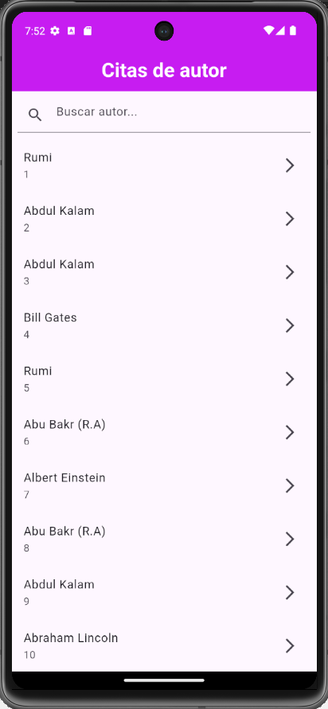
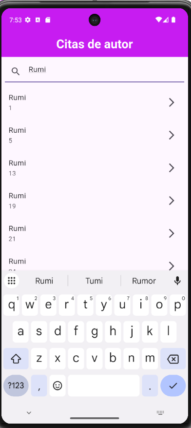
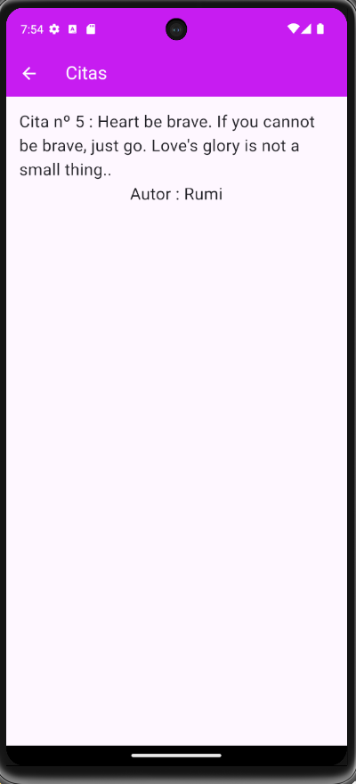

# Citas de Autor 📖

App Flutter que muestra un listado de citas de autores famosos con buscador en tiempo real y navegación al detalle.

## Capturas de pantalla

| Home | Buscando | Detalle |
|------|----------|---------|
|  |  |  |

## Características

- Listado de citas con autor y número
- Buscador en tiempo real por nombre de autor
- Filtrado dinámico con TextField
- Navegación a pantalla de detalle con la cita completa

## Tecnologías

- Flutter / Dart
- StatefulWidget
- ListView + TextField
- Navigator para navegación entre pantallas

## Cómo ejecutar

```bash
flutter pub get
flutter run
```
